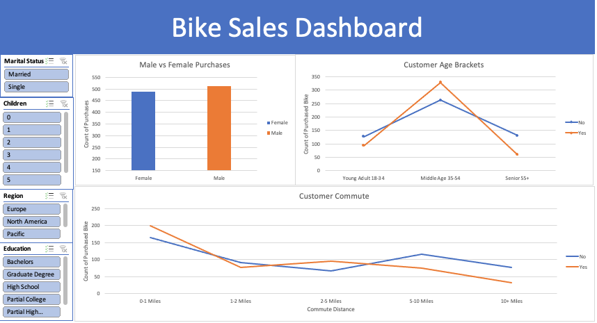

# Excel Bike Sales Analysis

### Project Overview

This project uses a raw Excel File containing data from a bike store and its sales. I used this data to create a professional dashboard with charts and pivot tables using the data from the Excel file. I aimed to find insights in customer behavior and segmentation in my analysis.

### Steps Taken

1. **Data Import**: The dataset was downloaded from Kaggle as a raw Microsoft Excel file.
2. **Cleaning**: This data was cleaned on Excel (removing duplicates, formatting, creating new columns etc.).
3. **Visualization**: The cleaned data was used for analysis with pivot tables and charts and then made into a dashboard on Excel.

### Tools and Technologies

- **Microsoft Excel**: Used for data cleaning, analysis, and dashboard creation.

### Repository Contents

- **Data**: The raw and cleaned dataset.
- **Revised Excel File**: The excel file used for analysis.
- **Dashboard**: The dashboard created on Excel.

### Findings

1. Sales by Age Group:

- Middle Age customers(35-54) are the only age group where more customers purchase bikes than not, regardless of gender, location, or marital status.
- Young Adults(18-34) purchase more bikes than Seniors(55+).

2. Sales by Gender:

- Men purchase more bikes than women in every region except Europe.
- Married men purchase substantially more bikes than married women.
- Single women purchase substantially more bikes than single men.
  
3. Sales by Region:

- People who commute 0-1 miles purchase the most bikes in every region except North America, where 2-5 miles is the most popular.
- The Pacific is the only region where customers in the Young Adults group(18-34) purchase more bikes than not.
- Europe is the only region where women purchase more bikes than men.
  
4. Sales by Education Level:
- Customers with Bachelors degrees purchase more bikes than any other education level.

### Recommendations
1. Targeted Marketing for Middle Age Customers:
- Develop targeted marketing campaigns focusing on Middle Age customers (35-54), as they are the most likely to purchase bikes. Use age-appropriate messaging and channels that resonate with this demographic.

2. Promote to Young Adults in the Pacific Region:
- Increase marketing efforts targeting Young Adults (18-34) in the Pacific region, as they are more likely to purchase bikes there. Highlight features that appeal to younger customers, such as trendy designs and social media campaigns.

3. Utilize Marital Status Insights:
- For married men, emphasize bikes as a family-friendly activity or stress-relief tool.
- For single women, promote bikes as a means of social activity, independence, and fitness.

4. Region-Specific Commuting Promotions:
- In regions where short-distance commuting (0-1 miles) is popular, create campaigns highlighting the convenience and efficiency of biking for short commutes. In North America, where 2-5 miles is the norm, emphasize the fitness benefits, time savings and gas savings of biking over driving.

