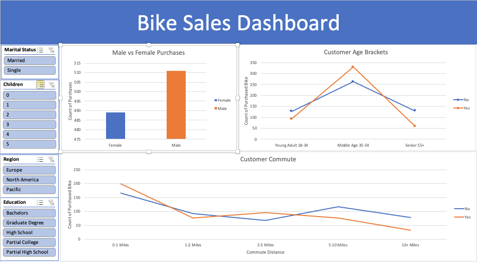

# ExcelBikeSalesAnalysis

### Project Overview

This project uses a raw Excel File containing data from a bike store and its sales. I used this data to create a professional dashboard with charts and pivot tables using the data from the Excel file. I aimed to find insights in customer behavior and segmentation in my analysis.

### Steps Taken

1. **Data Import**: The dataset was downloaded from Kaggle as a raw Microsoft Excel file.
2. **Cleaning**: This data was cleaned on Excel (removing duplicates, formatting, creating new columns etc.).
3. **Visualization**: The cleaned data was used for analysis with pivot tables and charts and then made into a dashboard on Excel.

### Tools and Technologies

- **Microsoft Excel**: Used for data cleaning, analysis, and dashboard creation.

### Repository Contents

- **Data**: The raw and cleaned dataset.
- **Revised Excel File**: The excel file used for analysis.
- **Dashboard**: The dashboard created on Excel.

### Findings

1. Sales by Age Group:

- Middle Age customers(35-54) is the only age group where more customers purchase bikes than not, regardless of gender, location, or marital status.
- Young Adults(18-34) purchase more bikes than Seniors(55+).

2. Sales by Gender:

- Men purchase more bikes than women.
- April peaked in sales.
- May sales were lower than April but higher than March.
  
3. Sales by Commuting Distance

- AAA 4-pack batteries and AA 4-pack batteries are by far the most popular products, but they also have the least revenue of any product.

4. Phone Sales:
- Vareebad Phones: Sales are significantly lower compared to iPhones and Google Phones.

### Recommendations
1. Targeted Marketing and Promotions:
- San Francisco, Los Angeles, and New York: Since these cities have the highest orders and revenue, consider focusing marketing efforts and promotions here to further capitalize on the existing customer base.
- New York: Investigate the lower sales compared to its population size. Tailored promotions or local events might boost engagement and sales in this area.

2. Seasonal Sales Strategies:
- January to March: Implement strategies to boost sales during these months, such as seasonal promotions and discounts, to maintain the upward trend after the holiday months.
- April Peak: Analyze the factors contributing to the high sales in April and replicate these strategies for other months.
- Post-April Strategy: Develop a retention and follow-up campaign in May to sustain the momentum gained in April.

3. AAA and AA Batteries Revenue:
- Since these are popular but low in revenue, consider offering larger packages (e.g., 8-pack or 12-pack) to increase the overall revenue per sale.
- Bundle these batteries with complementary products to enhance value.

4. Vareebadd Phone Pricing:
- Consider adjusting pricing strategies to compete better with iPhone and Google Phones.

